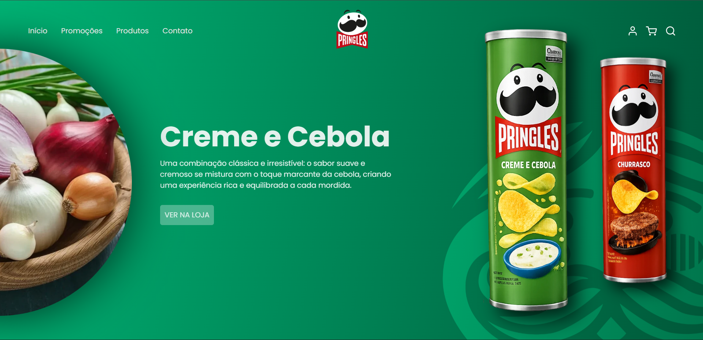

# Pringles Landing Page

A modern and animated landing page inspired by the Pringles brand.  
This project focuses on smooth animations, engaging visuals, and a clean interface to create an attractive user experience.

## Technologies Used
- HTML5  
- CSS3  
- JavaScript  
- GSAP 

## Project Goal
The goal of this project is to practice front-end development by building a simple yet visually appealing landing page, focusing on animations and user interaction.

## Features
- Smooth animations using GSAP  
- Modern and clean UI design  
- Interactive elements  
- Lightweight and fast loading  
- Brand-inspired visual experience  

## ⚠️ Responsiveness
This project is **optimized for desktop only**.  
It is not fully responsive for mobile devices.

## Preview

## Live Preview
**[Click here to view the project](https://hickmannnn.github.io/pringles-lading-page/)**